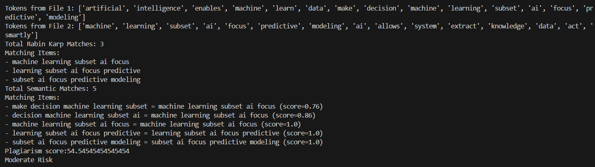
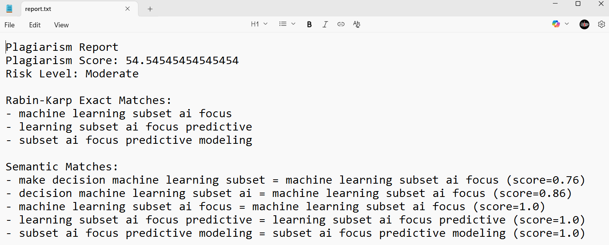

# 📑 PlagiSense: Intelligent Plagiarism Detection Using DSA + NLP

**PlagiSense** is a smart plagiarism detection system that combines classic Data Structures & Algorithms (DSA) with Natural Language Processing (NLP). It detects both **exact word-level matches** and **meaning-level paraphrasing** using a dual-layered approach:
- **Rabin-Karp Algorithm** for exact match detection
- **Sentence Embedding** for semantic similarity

---

## 🚀 Key Features

- ✅ Detects both direct copy-paste and paraphrased content
- 🧠 Uses **Rabin-Karp** for fast exact matching of word sequences
- 🧠 Applies **Sentence Embedding** to catch semantic similarities
- 📝 Generates a detailed plagiarism report (`report.txt`)
- 🎯 Calculates a plagiarism risk score and categorizes it

---

## 📸 Screenshots

| Description            | Screenshot |
|------------------------|------------|
| 1️⃣Terminal Output             |  |
| 2️⃣Plagiarism Report         |  |

---

## 📁 File Structure

```text
PlagiSense/
├── main.py # Main driver script
├── utility.py # Contains all logic: preprocessing, matching, scoring
├── screenshots/                # 🖼️ Screenshots folder
│   ├── 1.png 
│   └── 2.png
├── sample1.txt # First input text file
├── sample2.txt # Second input text file
├── report.txt # Auto-generated plagiarism report
└── README.md # Project documentation
```

---

## 🔍 Algorithm Overview

### 1. Rabin-Karp Algorithm (Exact Matching)
- A rolling hash-based string matching algorithm
- Efficiently detects **identical 5-word phrases** (5-grams) between two texts files

### 2. Sentence Embeddings (Semantic Matching)
Sentence Embeddings represent sentences as **numerical vectors** in high-dimensional space based on their meaning. Similar meanings result in closer vectors.

> 📌 **Example**:
> - "The cat is on the mat" and  
> - "A feline lies on the rug"  
> Both mean similar things, so their embeddings will have **high cosine similarity**, even if no words are exactly the same.

We use the `MiniLM` model from `sentence-transformers` to compare such 5-word sequences for **semantic overlap**.

---

## 🛠️ Setup Instructions

Follow these steps to run PlagiSense locally:

### 1. Clone or download the repository  
Make sure all the files (`main.py`, `utility.py`, `sample1.txt`, etc.) are in the same directory.

### 2. Install required packages

Open terminal or command prompt and run:

```bash
pip install nltk sentence-transformers
```

### 3. Download necessary NLTK resources

```bash
import nltk
nltk.download('punkt')
nltk.download('stopwords')
nltk.download('wordnet')
```
Or you can just run `main.py` once — it will automatically download them the first time.

### 4. Add Input Files

Replace the content of `sample1.txt` and `sample2.txt` with your own content to test.

### 5. Run the script

Run `main.py`

### 6. Check Output

Results will be printed in the **terminal** and saved to `report.txt`, including:

- Exact matches (Rabin-Karp)
- Semantic matches (Sentence Embedding)
- Plagiarism Score
- Risk Level (High/Moderate/Low)

---

## 🙏 Acknowledgements

- **DSA and NLP Implementation (Rabin-Karp Algorithm, N-Gram Generation, Text Preprocessing):** Designed and developed by ME (Naman Kumar).

- **Sentence Embedding Integration for Semantic Matching:** Implemented with assistance from university CSE department teachers and friends.


